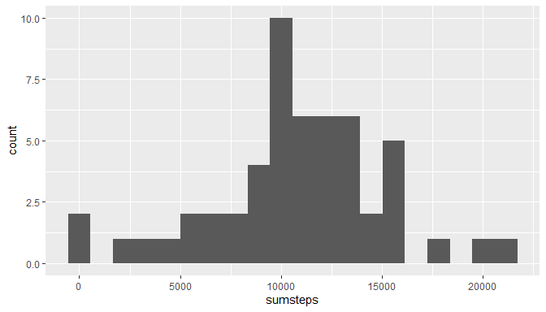

## Loading Libraries

```r
library(dplyr)
```

```
## 
## Attaching package: 'dplyr'
```

```
## The following objects are masked from 'package:stats':
## 
##     filter, lag
```

```
## The following objects are masked from 'package:base':
## 
##     intersect, setdiff, setequal, union
```

```r
library(tidyr)
library(ggplot2)
```
## 1. Code for reading in the dataset and/or processing the data


```r
activity_df =  read.csv(unz('activity.zip','activity.csv'))
activity_df$date = as.Date(activity_df$date)
bydate = na.omit(activity_df) %>% group_by(date)
byinterval = na.omit(activity_df) %>% group_by(interval)
```
## 2. Histogram of the total number of steps taken each day

```r
temp = bydate %>% summarise(sumsteps=sum(steps))
```

```
## `summarise()` ungrouping output (override with `.groups` argument)
```

```r
ggplot(temp,aes(sumsteps))+geom_histogram(bins=20)
```

<!-- -->
## 3. Mean and median number of steps taken each day

```r
bydate %>% summarise(meansteps = mean(steps),mediansteps = median(steps))
```

```
## `summarise()` ungrouping output (override with `.groups` argument)
```

```
## # A tibble: 53 x 3
##    date       meansteps mediansteps
##    <date>         <dbl>       <dbl>
##  1 2012-10-02     0.438           0
##  2 2012-10-03    39.4             0
##  3 2012-10-04    42.1             0
##  4 2012-10-05    46.2             0
##  5 2012-10-06    53.5             0
##  6 2012-10-07    38.2             0
##  7 2012-10-09    44.5             0
##  8 2012-10-10    34.4             0
##  9 2012-10-11    35.8             0
## 10 2012-10-12    60.4             0
## # ... with 43 more rows
```
## 4. Time series plot of the average number of steps taken

```r
temp = byinterval %>% summarise(meansteps=mean(steps))
```

```
## `summarise()` ungrouping output (override with `.groups` argument)
```

```r
ggplot(temp,aes(interval,meansteps))+geom_line()
```

<!-- -->

## 5. The 5-minute interval that, on average, contains the maximum number of steps


```r
temp[which.max(temp$meansteps),]
```

```
## # A tibble: 1 x 2
##   interval meansteps
##      <int>     <dbl>
## 1      835      206.
```
## 6. Code to describe and show a strategy for imputing missing data

**total number of missing values in the dataset**

```r
apply(activity_df,2,function(x) sum(is.na(x)))
```

```
##    steps     date interval 
##     2304        0        0
```

**imputed value is calculated by floor of average on each interval.**

```r
imputed_df = activity_df
imputed_val = byinterval %>% summarise(meanval = floor(mean(steps)))
```

```
## `summarise()` ungrouping output (override with `.groups` argument)
```

```r
for (i in 1:dim(activity_df)[[1]]){
  if(is.na(activity_df[i,'steps'])){
    imputed_df[i,'steps']=subset(imputed_val,interval==activity_df[i,'interval'])$meanval
  }
}
```

**median and mean of imputed df**

```r
imputed_df %>% group_by(date) %>%summarise(meansteps = mean(steps)
                                                     ,mediansteps = median(steps))
```

```
## `summarise()` ungrouping output (override with `.groups` argument)
```

```
## # A tibble: 61 x 3
##    date       meansteps mediansteps
##    <date>         <dbl>       <dbl>
##  1 2012-10-01    36.9          33.5
##  2 2012-10-02     0.438         0  
##  3 2012-10-03    39.4           0  
##  4 2012-10-04    42.1           0  
##  5 2012-10-05    46.2           0  
##  6 2012-10-06    53.5           0  
##  7 2012-10-07    38.2           0  
##  8 2012-10-08    36.9          33.5
##  9 2012-10-09    44.5           0  
## 10 2012-10-10    34.4           0  
## # ... with 51 more rows
```
*The mean and median value by date is differ from the original data*

## 7. Histogram of the total number of steps taken each day after missing values are imputed

```r
imputed_bydate = imputed_df%>% group_by(date)
temp = imputed_bydate %>% summarise(sumsteps=sum(steps))
```

```
## `summarise()` ungrouping output (override with `.groups` argument)
```

```r
ggplot(temp,aes(sumsteps))+geom_histogram(bins=20)
```

<!-- -->

## 8. Panel plot comparing the average number of steps taken per 5-minute interval across weekdays and weekends

```r
imputed_df$day = weekdays(imputed_df$date)
imputed_df$weekend =as.factor(imputed_df$day=='Sunday' | imputed_df$day=='Saturday')
levels(imputed_df$weekend)<-c('Weekday','Weekend')
gpdata = imputed_df %>%
    group_by(interval,weekend) %>% 
    summarise(steps=mean(steps))
```

```
## `summarise()` regrouping output by 'interval' (override with `.groups` argument)
```

```r
ggplot <-ggplot(data=gpdata,aes(x = interval,y=steps))
ggplot+geom_line()+facet_grid(rows =vars(weekend))
```

<!-- -->

## 9. All of the R code needed to reproduce the results (numbers, plots, etc.) in the report
Here is the markdown file.
